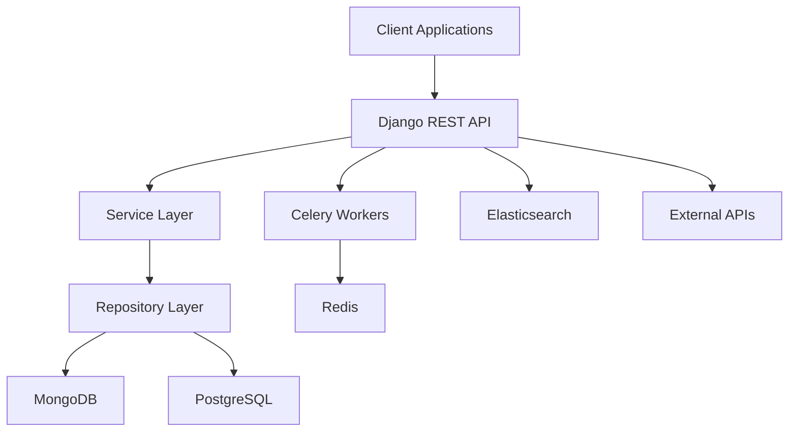
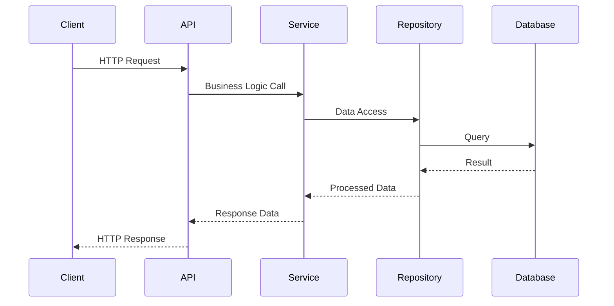

# VE-EDU-VAULT


## Overview

VE-EDU-VAULT is an enterprise-grade backend system designed to augment the Open edX platform with advanced educational capabilities. Built using modern Python and Django architecture, it provides sophisticated course management, assessment tools, and comprehensive analytics through a clean, scalable architecture that emphasizes maintainability and performance.

## Notable Highlights

### 🚀 Advanced Architecture
- **Async-First Design**: Native `asyncio` integration throughout the entire stack
- **Clean Architecture**: SOLID principles with dependency injection and interface segregation
- **Multi-Database Strategy**: PostgreSQL for relational data + MongoDB for document storage + Redis for caching
- **Event-Driven Architecture**: Webhook processing with QStash scheduling for reliable delivery

### 🎯 Sophisticated Algorithms
- **Real-Time Course Sync**: Chain of Responsibility pattern for detecting and applying course changes
- **Intelligent Diff Engine**: Atomic change detection with conflict resolution
- **Progressive Assessment**: Adaptive feedback with attempt tracking and mastery detection
- **Bulk Operation Optimization**: Memory-efficient streaming with batch processing

### 🔧 Production-Ready Features
- **Connection Pooling**: Optimized database connections with health monitoring
- **Distributed Task Processing**: Celery with Redis for background operations
- **LTI 1.3 Compliance**: Full Learning Tools Interoperability provider implementation
- **Comprehensive Error Handling**: Structured exception hierarchy with automatic retry logic

### 📊 Performance Engineering
- **Non-Blocking I/O**: Async generators for streaming large datasets
- **Query Optimization**: Prefetch strategies and select_related optimizations
- **Horizontal Scaling**: Stateless design with load balancer compatibility
- **Memory Efficiency**: Lazy loading and garbage collection optimization

## Architecture

### Architecture & Design Decisions

The codebase is organized around clean architecture principles to handle the complexity of educational data relationships and real-time processing requirements:

```
ve-edu-vault/
├── src/apps/          # 🎨 Presentation Layer (Django Views, Serializers, Admin)
├── src/library/       # 🧠 Business Logic (Domain Services, Use Cases)  
├── src/repository/    # 🗄️ Infrastructure (Database Abstractions, External APIs)
├── src/exceptions/    # ⚠️ Structured Error Handling Hierarchy
└── src/utils/         # 🔧 Shared Utilities & Mixins
```

**Why This Structure?**

Educational platforms have unique challenges: complex data relationships (courses → topics → subtopics → objectives), real-time assessment processing, and integration with external systems. This architecture separates these concerns while maintaining flexibility for different storage backends.

### Key Architectural Patterns

- **Repository Pattern**: Abstracts data access with swappable storage backends through dependency injection
- **Service Layer**: Contains pure business logic independent of web frameworks
- **Domain-Driven Design**: Models and entities align with educational domain concepts
- **CQRS-inspired Approach**: Separation of read and write operations through specialized repositories

### Design Patterns

| Pattern | Implementation | Business Value |
|---------|---------------|----------------|
| **Repository Pattern** | AbstractQuestionRepository with MongoDB/PostgreSQL implementations | Database-agnostic business logic |
| **Strategy Pattern** | ChangeProcessor with pluggable change strategies | Extensible course synchronization |
| **Factory Pattern** | GraderFactory for question type-specific grading | Type-safe assessment processing |
| **Chain of Responsibility** | DiffEngine with cascading handlers | Flexible change detection pipeline |
| **Command Pattern** | Course sync operations with undo capability | Reliable data migrations |

## Technology Stack

### Backend Framework
- **Django 5.2** with **Python 3.13**: Core web framework with modern async support
- **Django REST Framework**: API layer with custom async views
- **ADRF**: Async Django REST Framework extensions

### Data Storage
- **PostgreSQL 13+**: Primary relational database via Django ORM
- **MongoDB**: Document storage for questions, attempts, and analytics using Motor async driver
- **Redis**: Caching, session storage, and Celery message broker

### Asynchronous Processing
- **Asyncio**: Native Python async/await for database operations
- **Celery 5.4.0**: Distributed task queue for background processing
- **QStash**: Reliable scheduled operations for assessment timing

### Search & Analytics
- **Elasticsearch 7.x**: Full-text search with custom indexing strategies
- **Custom Signal Processor**: Optimized document synchronization

### Integration & Authentication
- **JWT**: Secure authentication implementation
- **LTI 1.3**: Learning Tools Interoperability provider
- **OAuth2**: External service integration
- **Webhooks**: Event-driven architecture support

## Core Components

### 1. Course Synchronization Engine

Implements sophisticated change detection and application:

```python
class DiffEngine:
    """Detects differences between course versions using Chain of Responsibility"""
    
class ChangeProcessor:
    """Applies changes using Strategy pattern with Command elements"""
```

**Features:**
- **Diff Engine**: Chain of responsibility pattern for detecting course changes
- **Change Processor**: Strategy pattern for applying different types of changes
- **Atomic Operations**: Database transactions ensure consistency
- **Conflict Resolution**: Handles concurrent modifications

### 2. Assessment & Grading System

Comprehensive question and assessment management:

```python
class AssessmentGrader:
    """Grades complete assessments with configurable thresholds"""
    
class SingleQuestionGrader:
    """Handles individual question grading with attempt tracking"""
```

**Capabilities:**
- **Multi-type Question Support**: Multiple choice, fill-in-the-blank, with extensible grader factory
- **Attempt Tracking**: Complete history with mastery detection
- **Configurable Scoring**: Flexible grading rules and thresholds
- **Progressive Feedback**: Contextual hints and explanations
- **Bulk Operations**: Efficient processing of multiple attempts

### 3. Repository Layer

Abstract data access with concrete implementations:

```python
class AbstractQuestionRepository(ABC):
    """Interface for question data operations"""
    
class MongoQuestionRepository(AbstractQuestionRepository):
    """MongoDB-specific implementation with async operations"""
```

**Design:**
- **Interface Segregation**: Specialized repositories for different concerns
- **Dependency Injection**: Swappable backend implementations
- **Connection Pooling**: Optimized database connection management
- **Error Handling**: Comprehensive exception hierarchy with retry logic

### 4. Async Database Operations

High-performance async data layer:

```python
class AsyncMongoDatabaseEngine:
    """Async MongoDB operations with connection pooling"""
    
async def fetch_from_db(self, collection_name: str, query: Dict) -> AsyncGenerator:
    """Streaming data retrieval with batching"""
```

**Features:**
- **Connection Pooling**: Efficient resource utilization
- **Batch Processing**: Memory-efficient data streaming
- **Error Recovery**: Automatic retry with exponential backoff
- **Type Safety**: Comprehensive Pydantic model validation

### 5. Integration Layer

External system connectivity:

```python
class EdxClient:
    """OAuth2-enabled client for Open edX API integration"""
    
class LTIProvider:
    """LTI 1.3 compliant learning tools integration"""
```

**Integrations:**
- **Open edX**: Course content synchronization
- **LTI 1.3**: External tool launching
- **OAuth2**: Secure API access
- **Webhook Processing**: Event-driven updates

## Extensibility & Developer Experience

### 🔌 Plugin Architecture

#### Extensible Question Types
```python
class GraderFactory:
    """Register custom question graders without modifying core code"""
    
# Add new question type
GraderFactory.register_grader("custom-type", CustomGrader)
```

#### Swappable Data Backends
```python
class AbstractQuestionRepository(ABC):
    """Implement custom storage backends"""
    
# Redis implementation
class RedisQuestionRepository(AbstractQuestionRepository):
    pass
```

### 🛠 Developer Productivity

#### Hot Reloading & Live Development
```bash
make serve-async    # Auto-reload on code changes
make test-watch     # Continuous testing
make lint-fix       # Auto-format code
```

#### Comprehensive Tooling
- **Type Safety**: Full mypy coverage with strict mode
- **Code Quality**: Pre-commit hooks with Black, isort, flake8
- **Test Data**: Factory Boy for realistic test scenarios

### 🎯 Extension Points

#### Custom Assessment Logic
```python
class CustomAssessmentGrader(AssessmentGrader):
    """Override grading behavior for specific requirements"""
    
    def calculate_metrics(self, summaries):
        # Custom scoring algorithm
        return super().calculate_metrics(summaries)
```

#### Custom Data Processors
```python
class CustomChangeProcessor(ChangeProcessor):
    """Add custom course change handling"""
    
    def process_custom_changes(self, changes):
        # Handle domain-specific changes
        pass
```

#### Event System Integration
```python
@webhook_registry.register("custom.event.type")
class CustomEventHandler(WebhookHandler):
    """Handle custom webhook events"""
```

### 🚀 Quick Start Extensions

#### 1. Add Custom Question Type
```python
# 1. Define grader
class ImageQuestionGrader(AbstractQuestionGrader):
    def grade(self, question, answer): ...

# 2. Register with factory  
GraderFactory.register_grader("image-question", ImageQuestionGrader)

# 3. Questions automatically work with new type
```

#### 2. Custom Analytics Pipeline
```python
# 1. Extend repository
class AnalyticsQuestionRepository(MongoQuestionRepository):
    async def track_analytics(self, event): ...

# 2. Dependency injection handles the rest
```

#### 3. External System Integration
```python
# 1. Implement webhook handler
class CanvasIntegrationHandler(WebhookHandler):
    def handle(self, payload): ...

# 2. Register with system
webhook_registry.register("canvas.grade.sync", CanvasIntegrationHandler)
```

## Development Workflow

### Code Quality & Testing

| Tool | Purpose | Configuration |
|------|---------|---------------|
| **mypy** | Static type checking | Comprehensive type annotations |
| **Black** | Code formatting | Pre-commit hook integration |
| **isort** | Import sorting | Consistent import organization |
| **flake8** | Code linting | Style guide enforcement |
| **pytest** | Testing framework | Comprehensive test coverage |
| **Factory Boy** | Test data generation | Realistic test scenarios |
| **Docker** | Environment consistency | Development and deployment |

### Performance Optimizations

| Optimization | Implementation | Benefit |
|-------------|----------------|---------|
| **Async/Await** | Non-blocking I/O operations | Improved concurrency |
| **Connection Pooling** | Optimized database connections | Resource efficiency |
| **Batch Processing** | Efficient bulk operations | Reduced overhead |
| **Caching Strategy** | Redis-based intelligent invalidation | Faster response times |
| **Query Optimization** | Prefetch relationships and select optimization | Reduced database load |

### Error Handling & Monitoring

```python
class VirtuEducateError(Exception):
    """Structured exception hierarchy with context"""
    
class UnifiedAPIErrorHandler:
    """Centralized error processing with proper HTTP status mapping"""
```

**Features:**
- **Structured Exceptions**: Hierarchical error types with contextual information
- **Logging Strategy**: Comprehensive logging with structured data
- **Graceful Degradation**: Fallback mechanisms for external service failures

## API Design

### RESTful Architecture

| Feature | Implementation | Description |
|---------|---------------|-------------|
| **Resource-based URLs** | Clear, predictable endpoint structure | Intuitive API navigation |
| **HTTP Status Codes** | Proper semantic status code usage | Standard compliant responses |
| **Request/Response Format** | Consistent JSON API with proper serialization | Predictable data format |
| **Authentication** | JWT-based with scope validation | Secure access control |
| **Rate Limiting** | Configurable throttling mechanisms | API protection |

### Async API Views

```python
class ActiveAssessmentView(EducationContextMixin, CustomRetrieveAPIView):
    async def _async_retrieve(self, request, *args, **kwargs):
        """Async implementation with concurrent data fetching"""
```

## Getting Started

### Prerequisites

| Component | Version | Purpose |
|-----------|---------|---------|
| **Python** | 3.13+ | Runtime environment |
| **PostgreSQL** | 13+ | Primary database |
| **MongoDB** | 4.4+ | Document storage |
| **Redis** | 6.0+ | Caching and message broker |
| **Elasticsearch** | 7.x | Search and analytics |

### Installation

```bash
# Clone repository
git clone https://github.com/your-organization/ve-edu-vault.git
cd ve-edu-vault

# Setup virtual environment
uv venv .venv
source .venv/bin/activate  # On Windows: .venv\Scripts\activate

# Install dependencies
uv sync --all-groups

# Configure environment
cp .env.sample .env
# Edit .env with your configuration

# Initialize database
make migrate-dev

# Start development server
make serve-async
```

### Available Commands

```bash
make help  # Display all available commands with descriptions
```

### Common Development Tasks

| Command | Purpose |
|---------|---------|
| `make serve-async` | Start development server with async support |
| `make test` | Run test suite |
| `make test-watch` | Continuous testing |
| `make lint` | Run code quality checks |
| `make lint-fix` | Auto-fix code quality issues |
| `make migrate-dev` | Apply database migrations |
| `make shell` | Start Django shell |

### Production Considerations

| Aspect | Strategy | Implementation |
|--------|----------|----------------|
| **Horizontal Scaling** | Stateless design | Load balancer compatibility |
| **Caching Strategy** | Multi-layer caching | Redis integration |
| **Monitoring** | Comprehensive logging | Metrics collection |
| **Security** | JWT authentication | Input validation, SQL injection protection |

## Architecture Diagrams



### Component Interaction Flow




---

**VE-EDU-VAULT** represents a modern approach to educational technology infrastructure, combining proven architectural patterns with cutting-edge Python technologies to deliver a scalable, maintainable platform for enhanced learning experiences.
