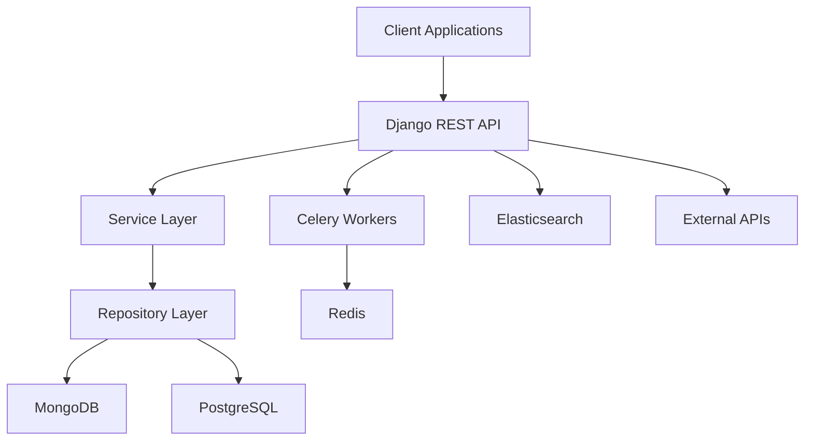
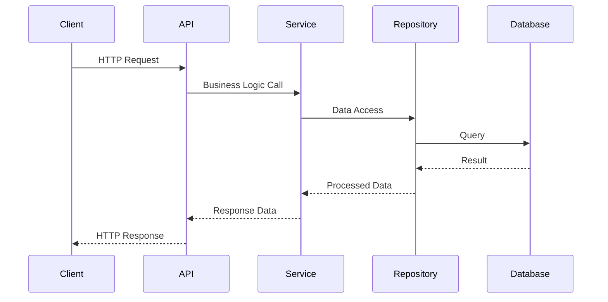

# VE-EDU-VAULT: Why I Built This Backend for Educational Impact in Malawi


## What This Project Is Really About

**VE-EDU-VAULT** is one of the backends for [Virtu Educate](https://github.com/Virtu-E) - a platform providing quality education resources tailored specifically for Malawian students and their unique challenges. 

**The Setup:** Virtu Educate runs on Open edX (the platform used by Harvard and MIT), and Edu Vault serves as the augmentation layer that optimizes and extends Open edX in a scalable way. This repo captures the core engineering principles of our educational platform.

## My Tech Stack Decisions (Everything is a Trade-off)

I understand that everything in tech is a trade-off. Here's why I chose what I chose over other options:

### **Python/Django** *(over Node.js, Go, or Java)*
- **Why Python**: Open edX runs on Python - seamless integration
- **Why Django**: I'm knowledgeable in it, and it's proven to scale (Open edX itself uses Django in production)
- **Trade-off**: Could be faster with Go, but integration complexity isn't worth it for our use case

### **Multi-Database Strategy** *(over single database)*

| Database | Purpose | Why This Over Alternatives |
|----------|---------|---------------------------|
| **PostgreSQL** | Core schema (subjects, topics, users) | **vs MySQL**: Better JSON support, proven reliability |
| **MongoDB** | Questions & assessments | **vs PostgreSQL**: Schema flexibility without migrations for evolving question types |


### **Background Processing** *(over synchronous operations)*

| Tool | Purpose | Why This Choice |
|------|---------|----------------|
| **Celery + Redis** | Course sync, email, exam grading | **vs RQ**: More mature, better monitoring |
| **QStash** | Timed exam management | **vs Celery Beat**: Managed service = less maintenance overhead |

### **Authentication Strategy** *(over single auth method)*
- **OAuth2**: Open edX ↔ Edu Vault integration *(industry standard for service-to-service)*
- **JWT**: Web client authentication *(stateless, mobile-friendly)*

### **Search Evolution** *(pragmatic over perfect)*
- **Started with**: Elasticsearch *(over-engineering for our scale)*
- **Ended up with**: PostgreSQL full-text search *(good enough, one less service to maintain)*
- **Future**: Might switch back to Elasticsearch when we actually need it

## What I Really Like About This Codebase

### 🚀 The Architecture is Actually Clean

This isn't just another Django project thrown together. I spent time thinking about how educational platforms actually work - the complexity of course relationships, real-time assessment processing, integration with external systems. The architecture separates these concerns properly:

```
ve-edu-vault/
├── src/apps/          # 🎨 Presentation Layer (Django Views, Serializers, Admin)
├── src/library/       # 🧠 Business Logic (Domain Services, Use Cases)  
├── src/repository/    # 🗄️ Infrastructure (Database Abstractions, External APIs)
├── src/exceptions/    # ⚠️ Structured Error Handling Hierarchy
└── src/utils/         # 🔧 Shared Utilities & Mixins
```

**Why This Structure Works:**
- Educational platforms have unique challenges: complex data relationships (courses → topics → subtopics → objectives)
- Real-time assessment processing requirements
- Integration with external systems
- This architecture separates these concerns while maintaining flexibility for different storage backends

### 🎯 The Patterns Actually Make Sense

I didn't just throw design patterns at the wall to see what sticks. Each pattern solves a real problem:

| Pattern | Why I Used It | Real Business Value |
|---------|---------------|-------------------|
| **Repository Pattern** | Database-agnostic business logic | Can swap MongoDB for PostgreSQL without touching business logic |
| **Strategy Pattern** | Pluggable change strategies for course sync | Easy to add new course change types without modifying existing code |
| **Factory Pattern** | Type-safe assessment processing | Each question type has its own grader, extensible |
| **Chain of Responsibility** | Flexible change detection pipeline | Can detect and handle different types of course changes |
| **Command Pattern** | Reliable data migrations with undo | Course sync operations can be rolled back if something goes wrong |

### 🔧 It's Actually Production Ready

This isn't a toy project. Here's what makes it production-grade:

**Performance Engineering That Actually Matters:**
- **Async-First Design**: Native `asyncio` integration throughout the entire stack - because when you have thousands of students taking exams simultaneously, blocking I/O kills performance
- **Connection Pooling**: Optimized database connections with health monitoring - learned this the hard way when we had connection leaks
- **Memory-Efficient Streaming**: Async generators for streaming large datasets - because loading 10,000 student records into memory is a bad idea
- **Query Optimization**: Prefetch strategies and select_related optimizations - N+1 queries are the enemy

**Error Handling That Actually Works:**
```python
class VirtuEducateError(Exception):
    """Structured exception hierarchy with context"""
    
class UnifiedAPIErrorHandler:
    """Centralized error processing with proper HTTP status mapping"""
```

I built a proper exception hierarchy because generic "something went wrong" errors don't help anyone. When a student can't submit an exam, I need to know exactly what failed and why.

**Multi-Database Strategy That Makes Sense:**
- PostgreSQL for relational data (courses, users, grades) - because ACID compliance matters for student records
- MongoDB for document storage (questions, attempts) - because question schemas evolve and migrations are painful
- Redis for caching and task queues - because synchronization between systems needs to be fast

### 📊 The Integration Layer is Robust

**LTI 1.3 Compliance**: Full Learning Tools Interoperability provider implementation - because educational tools need to work together, not in silos.

**OAuth2 Integration**: Secure API access between Open edX and our backend - because student data security isn't negotiable.

**Webhook Processing**: Event-driven architecture with QStash scheduling - because when a course is updated in Open edX, students need to see those changes immediately.

## Architecture Diagrams



### How the Components Actually Work Together



## Technology Stack Deep Dive

### Backend Framework
- **Django 5.2 with Python 3.13**: Core web framework with modern async support
- **Django REST Framework**: API layer with custom async views
- **ADRF**: Async Django REST Framework extensions

### Data Storage
- **PostgreSQL 13+**: Primary relational database via Django ORM
- **MongoDB**: Document storage for questions, attempts, and analytics using Motor async driver
- **Redis**: Caching, session storage, and Celery message broker

### Asynchronous Processing
- **Asyncio**: Native Python async/await for database operations
- **Celery 5.4.0**: Distributed task queue for background processing
- **QStash**: Reliable scheduled operations for assessment timing

### Integration & Authentication
- **JWT**: Secure authentication implementation
- **LTI 1.3**: Learning Tools Interoperability provider
- **OAuth2**: External service integration
- **Webhooks**: Event-driven architecture support

## The Developer Experience is Actually Good

### 🔌 It's Extensible Without Being Overcomplicated

Want to add a new question type? Register a grader:
```python
class ImageQuestionGrader(AbstractQuestionGrader):
    def grade(self, question, answer): ...

GraderFactory.register_grader("image-question", ImageQuestionGrader)
```

Want to add a new data backend? Implement the interface:
```python
class RedisQuestionRepository(AbstractQuestionRepository):
    # Redis-specific implementation
    pass
```

### 🛠 The Development Workflow Actually Works

```bash
make serve-async    # Auto-reload on code changes
make test-watch     # Continuous testing
make lint-fix       # Auto-format code
make help          # See all available commands
```

**Code Quality Tools That Actually Help:**
- **mypy**: Static type checking with comprehensive type annotations
- **Black**: Code formatting that I don't have to think about
- **isort**: Import sorting that's consistent
- **pytest**: Testing framework with realistic test scenarios using Factory Boy

## What This Means for Students

Every architectural decision serves the mission: **enabling quality education for Malawian students.**

- **Async Operations**: Thousands of students can take exams simultaneously without the system choking
- **Intelligent Caching**: Fast content delivery even with limited internet infrastructure
- **Flexible Content Schema**: Questions can evolve without database downtime
- **Reliable Background Processing**: Automatic grading and notifications work even when the main system is busy
- **OAuth2 Security**: Student data is protected while maintaining seamless integration

## The Real Impact

This isn't just a backend system - it's the foundation for educational transformation in Malawi. Every performance optimization means more students can access learning. Every reliability improvement means fewer interrupted study sessions. Every feature addition means better educational outcomes.

**This is why I built this the way I did** - because quality education should be accessible to every Malawian student, and the technology should be robust enough to serve that mission at scale.

---

*VE-EDU-VAULT: Engineering quality education for Malawi, one async operation at a time.*
